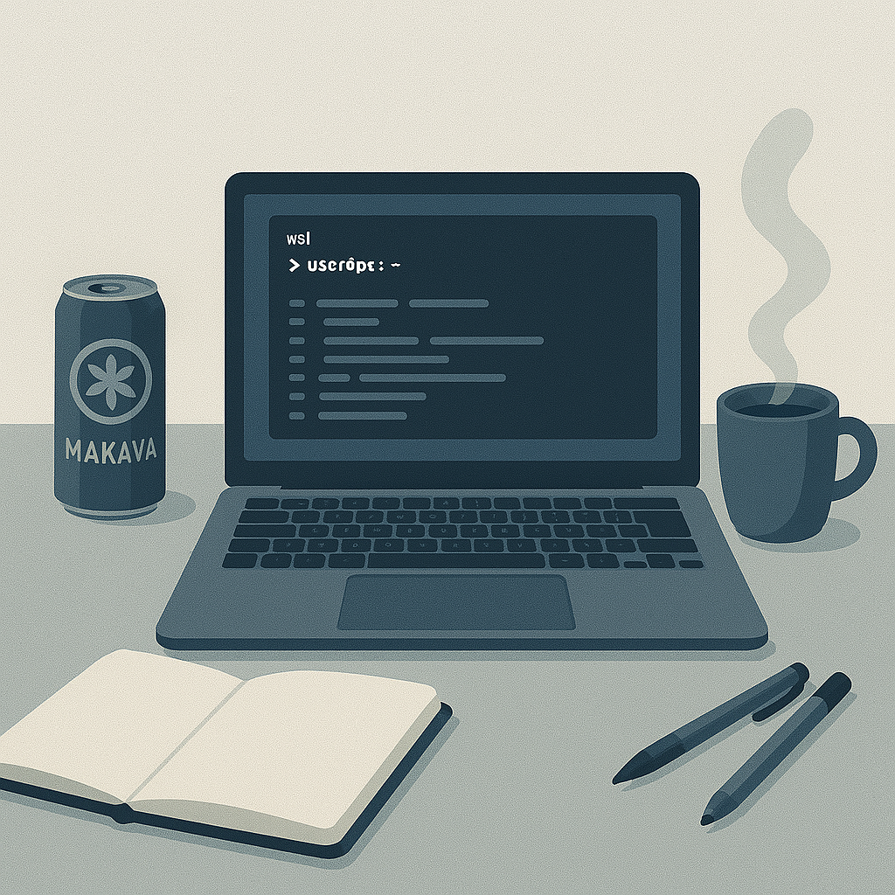

I'm an aspiring Embedded Systems Engineer with a BSc in Information 
and Computer Enginneering, passionate about systems that connect to the real world.

## I am Currently Working on...
- Strengthening my C/C++ skills for embedded systems  
- Exploring RTOS, IoT, and low-level Linux development  

## My Goals are...  
- Becoming a skilled, confident embedded developer  
- Learning by doing projects and sharing them
- Connecting with people

## My Learning

- ARM architecture & microcontroller programming  
- Real-time systems and peripheral interfacing  
- Yocto, build systems, and cross-compilation 
- Sensor applications in automotive industry
 
 
 
 

## Statistics

## Tech Stack

## Connect with Me

